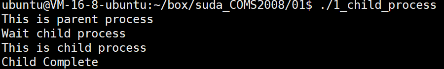
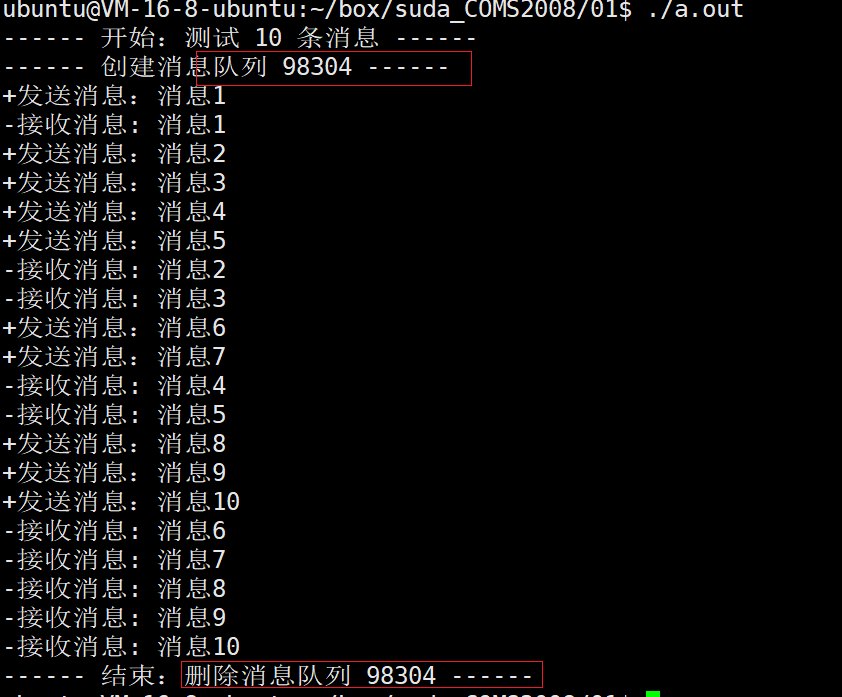
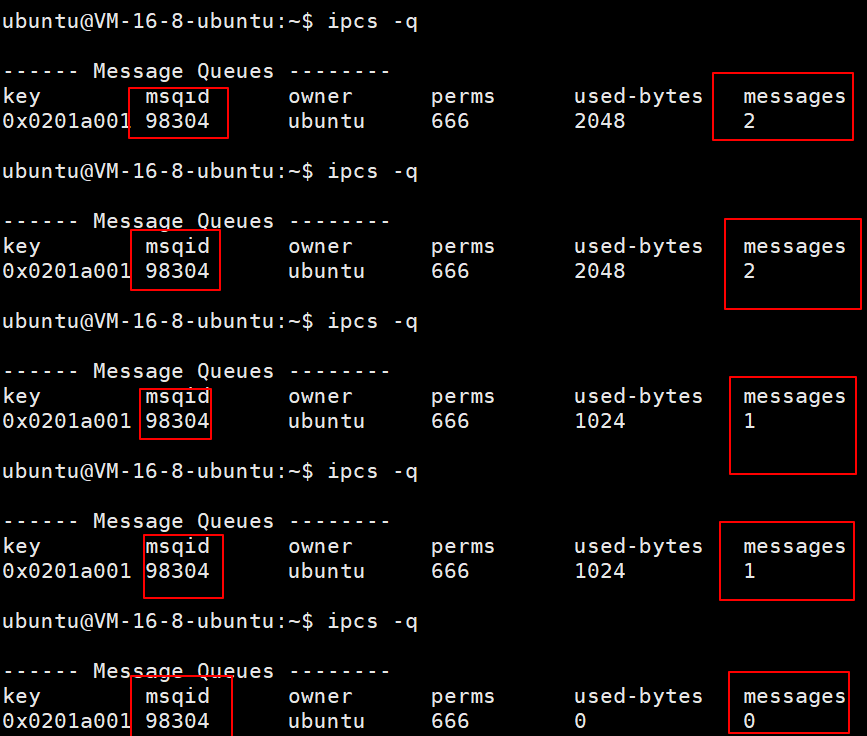

# 实验一 进程创建及进程间通信

## 实验环境

Linux  平台 

## 实验时间

4  小时 

## 实验目的

掌握进程创建的系统调用，了解 Linux 下进程间通信机制，并学会使用一种进程通信方式。 

## 实验内容

1、 编制一个 C 程序，创建子进程，并输出提示信息，说明父子进程。 
2、 编写 C 程序，使用 Linux IPC 机制实现两个进程间通信， 

## 实验步骤

1. 编写 C 程序，实现创建子进程的功能，并记录输出信息；

    * 程序代码

        ```c
        // 实验 1-1 创建进程
        #include<unistd.h>
        #include<stdlib.h>
        #include<stdio.h>
        #include<sys/types.h>
        int main()
        {
          pid_t  pid;
            /* 创建进程  */
            pid = fork();
            if (pid < 0) { /* 出现错误  */
                fprintf(stderr, "Fork Failed");
                exit(-1);
            }
            else if (pid == 0) { /* 子进程  */
                printf("This is child process \n");
            }
            else { /* 父进程 */
                /* 等待子进程完成 */
                printf("This is parent process \n");
                printf("Wait child process \n");
                wait (NULL);
                printf ("Child Complete \n");
                exit(0);
            }
        }
        ```

    * 输出信息

      

2. 简述 Linux IPC 常用的经常通信方法，并说明你所选择实现的通信方法及选择理由； 
   1. **管道**（Pipe）及有名管道（named pipe）：管道可用于具有亲缘关系进程间的通信，有名管道克服了管道没有名字的限制，因此，除具有管道所具有的功能外，它还允许无亲缘关系进程间的通信
   2. **信号**（Signal）：信号是比较复杂的通信方式，用于通知接受进程有某种事件发生，除了用于进程间通信外，进程还可以发送信号给进程本身；linux除了支持Unix早期信号语义函数sigal外，还支持语义符合Posix.1标准的信号函数sigaction
   3. **消息队列**（报文队列）：消息队列是消息的链接表，包括Posix消息队列system V消息队列。有足够权限的进程可以向队列中添加消息，被赋予读权限的进程则可以读走队列中的消息。消息队列克服了信号承载信息量少，管道只能承载无格式字节流以及缓冲区大小受限等缺点
   4. **共享内存**：使得多个进程可以访问同一块内存空间，是最快的可用IPC形式。是针对其他通信机制运行效率较低而设计的。往往与其它通信机制，如信号量结合使用，来达到进程间的同步及互斥
   5. **信号量**（semaphore）：主要作为进程间以及同一进程不同线程之间的同步手段
   6. **套接字**（Socket）：更为一般的进程间通信机制，可用于不同机器之间的进程间通信。起初是由Unix系统的BSD分支开发出来的，但现在一般可以移植到其它类Unix系统上：Linux和System V的变种都支持套接字。

   在本次实验中，选取消息队列的方式进行通讯。因为消息队列不局限于父子进程，而允许任意进程通过共享消息队列来实现进程间通信．并由系统调用函数来实现消息发送和接收之间的同步，从而使得用户在使用消息缓冲进行通信时不再需要考虑同步问题，使用方便。
   
3. 根据第 2 步选择的进程通信方法编写 C 程序，实现进程通信，说明传递消息的定义，进程通信的过程（比如如何新建消息队列、发送消息、接收消息等）。 

    * 消息队列定

      1. 使用 `ftok`，根据关键字生成标识符。

         ```c
         key = ftok("/tmp", 2);  // 创建标识符
         ```

         

      2. 使用 `msgget`，传入生成的标识符以及 flag。返回消息队列的 id，用于之后发送、接受消息和对消息队列的管理。

      ```c
      // 创建消息队列（如果不存在则创建，如果已经存在则报错），并获取id
      msg_id = msgget(key, IPC_CREAT|IPC_EXCL|0666);	
      ```

    * 发送消息

      * 发送消息前，需要定义一个消息的 `struct`。

        ```c
        // 消息结构体
        struct msgbuf
        {
        	long mtype;  // 必须以长整型开始
        	char mtext[1024];  // 内容
        };
        
        struct msgbuf send_buf;
        // 给消息赋值
        send_buf.mtype = 1;  // 接收者以此确定消息类型
        sprintf(send_buf.mtext, "消息%d", msg_count++); 
        ```

      * 使用 `msg_id` 发送消息，传入消息队列的 id、消息体、消息长度和 flag。

      ```c
      msgsnd(msg_id, (void*)&send_buf, sizeof(send_buf.mtext), 0)
      ```

    * 接收消息

      * 创建接受消息的 `struct`。

        ```c
        // 消息结构体
        struct msgbuf
        {
        	long mtype;  // 必须以长整型开始
        	char mtext[1024];  // 内容
        };
        struct msgbuf rcv_buf;
        ```

      * 使用 `msgrcv`接受消息，传入消息队列的 id、接受消息的 struct、消息长度、1 和 flag。

        ```c
        msgrcv(msg_id, (void*)&rcv_buf, sizeof(rcv_buf.mtext), 1, 0)
        ```

        

    * 程序代码

    ```c
    // 实验 1-2 通过消息队列，实现进程间的通讯
    #include <stdio.h>
    #include <stdlib.h>
    #include <string.h>
    #include <sys/ipc.h>
    #include <sys/types.h>
    #include <sys/msg.h>
    
    // 消息结构体
    struct msgbuf
    {
    	long mtype;  // 必须以长整型开始
    	char mtext[1024];  // 内容
    };
    
    int main(void)
    {
    	key_t key;  // 标识符
    	int msg_id;  // 消息 id
    	pid_t pid;  // 进程 id
    	int msg_count = 1;  // 给 msg 计数
    
    	// 创建消息队列
    	key = ftok("/tmp", 2);  // 创建标识符
    	// 判断是否生成 key
    	if (key < 0)
    	{
    		// 如果失败，退出
    		perror("ftok");
    		return -1;
    	}
    	
    	// 创建消息队列（如果不存在则创建，如果已经存在则报错），并获取id
    	msg_id = msgget(key, IPC_CREAT|IPC_EXCL|0666);	
    	if (msg_id < 0)
    	{
    		// 当 msg 已经存在或创建失败时，返回 -1
    		perror("msgget");
    			return -1;
    	}
    	printf("------ 开始：测试 10 条消息 ------\n");
    	printf("------ 创建消息队列 %d ------\n", msg_id);
    	// 创建 生产者 和 消费者进程
    	// 父进程：生产者
    	// 子进程：消费者
    	pid = fork();
    	if (pid < 0)
    	{
    		// 创建进程出错，退出
    		perror("fork");
    		return -1;
    	} else if (pid == 0)
    	{
    		// 子进程 -》消费者
    		// 循环消费消息
    		int count_rcv = 0;
    		while(++count_rcv <= 10)
    		{
    		struct msgbuf rcv_buf;
    		if (msgrcv(msg_id, (void*)&rcv_buf, sizeof(rcv_buf.mtext), 1, 0) < 0)
    		{
    			// 当返回值为 -1 时，接受失败
    			perror("msgrcv");
    			return -1;
    		}
    
    		printf("-接收消息: %s\n", rcv_buf.mtext);
    
    		sleep(random() % 5);  // 随机暂停几秒
    		}
    		
    		// 删除队列
    		msgctl(msg_id, IPC_RMID, NULL);
    		printf("------ 结束：删除消息队列 %d ------\n", msg_id);
    
    	} else 
    	{
    		// 父进程 -》生产者
    		// 循环生产消息
    		while (msg_count <= 10)
    		{
    			struct msgbuf send_buf;
    			send_buf.mtype = 1;  // 接收者以此确定消息类型
    
    			// send_buf.mtext = "发送消息啦";  // 发送消息的内容
    			// strcpy(send_buf.mtext, "发消息啦");  // 使用 strcpy 给数组赋值
    			sprintf(send_buf.mtext, "消息%d", msg_count++); 
    
    			if (msgsnd(msg_id, (void*)&send_buf, sizeof(send_buf.mtext), 0) < 0)
    			{
    				// 当返回值为 -1 时，发送失败
    				perror("msgsnd");
    				return -1;
    			}
    			printf("+发送消息：%s\n", send_buf.mtext);
    
    			sleep(random() % 3);  // 随机暂停几秒
    		}
    
    		// 等待子进程结束, 防止命令行错乱
    		wait(NULL);
    	}
    	return 0;
    }
    ```

    * 程序结果

      



## 实验分析及总结

在第一个实验中，使用 fork 来创建一个子进程，fork 将会返回两次，在以往的编程经历中从未遇见过的。虽然看上去时一个程序里面两个互斥的分支都被执行了，这当然是不可能的，本质上是同一个程序在两个进程上运行了两次。我们会根据 fork 的返回值来判断是父进程、子进程或者出错。

在第二个实验中，我们需要让两个进程通过消息队列通讯，在最初时如何创建这两个进程就需要进行选择：1. 在一个进程中创建一个子进程 2. 运行两个 c 程序。两个本质上都是一样的，都创建了两个进程，我们借用第一个实验的代码，所以选择了在一个进程中创建一个子进程。如何让两个进程通过消息队列通讯，关键的地方是需要让两个进程能够获取同一个消息队列，即知道同一个消息队列的 id，所以在实验中，将存储消息队列的 id 的变量，供两个进程使用。在使用消息队列传递消息时，必须自己定义 消息的数据结构，并且在传递消息的时候给出消息的长度，这样接收方才能够正确地接受消息。