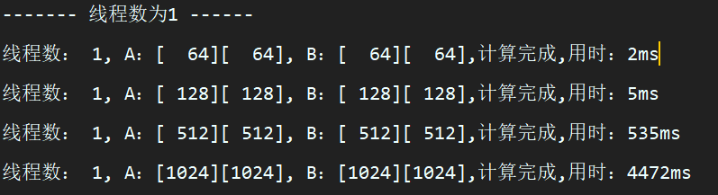
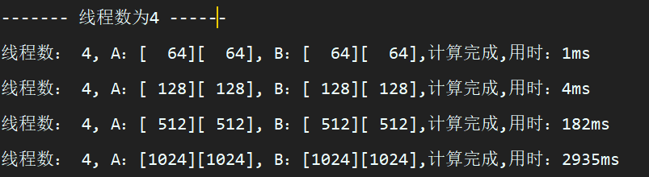
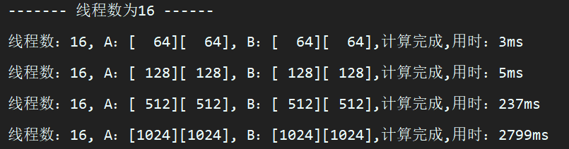
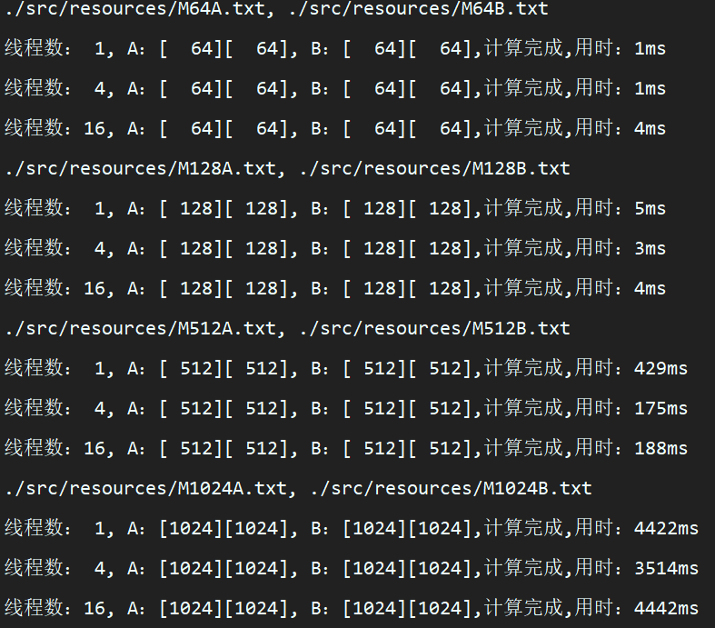
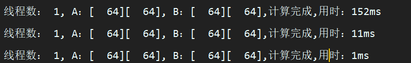

[toc]

## 实验二、多线程矩阵相乘

### 实验环境：

Linux 平台或 Wnidows 平台 

### 实验时间：

2 小时 

### 实验目的：

掌握多线程编程技术，理解多线程的优点和缺点。 

### 实验目标：

编制一个程序，采用单线程、4 线程和 16 线程来计算两个矩阵 A 和 B 的乘积。其中，矩阵大小分别为 16 * 16,128 * 128，512*512。 

### 实验步骤：

1、开发一个单线程的程序，分别计算 16 * 16,128 * 128，512 * 512矩阵的乘积，并记录矩阵相乘花费的时间； 

2、开发一个 4线程的程序，分别计算 16 * 16,128 * 128，512*512矩阵的乘积，并记录矩阵相乘花费的时间； 

3、开发一个 16 线程的程序，分别计算 16 * 16,128 * 128，512*512 矩阵的乘积，并记录矩阵相乘花费的时间。 

----
代码实现

1.  FileToMatrices.java 读取文件生成矩阵

   ```java
   package com.os.zlj;
   
   import java.io.*;
   import java.util.ArrayList;
   import java.util.Arrays;
   
   public class FileToMatrices {
       private float[][] A, B;
   
       public FileToMatrices(String fileA, String fileB) {
           // 读取文件
           A = toMatrices(fileA);
           B = toMatrices(fileB);
       }
   
       public FileToMatrices() {
           // 默认构造测试数据
           this("./src/resources/M64A.txt", "./src/resources/M64B.txt");
       }
   
       public static void main(String[] args) {
           File file = new File(".");
           System.out.println(file.getAbsolutePath());
           FileToMatrices fileToMatrices = new FileToMatrices();
           System.out.println(fileToMatrices);
       }
   
       public float[][] getA() {
           return A;
       }
   
       public void setA(float[][] a) {
           A = a;
       }
   
       public float[][] getB() {
           return B;
       }
   
       public void setB(float[][] b) {
           B = b;
       }
   
   
       private float[][] toMatrices(String fileName) {
           float[][] array = new float[0][];
           // 读取文件
           try (
                   Reader reader = new FileReader(fileName);
                   BufferedReader bufferedReader = new BufferedReader(reader)
           ) {
               ArrayList<String> arrayList = new ArrayList<>();
               String line;
               while ((line = bufferedReader.readLine()) != null) {
                   arrayList.add(line);
               }
   
               // 创建数组
               int high = arrayList.size();
               int width = arrayList.get(0).split(" ").length;
               array = new float[high][width];
   
               String[] splitLine;
               for (int i = 0; i < high; i++) {
                   splitLine = arrayList.get(i).split(" ");
                   for (int j = 0; j < width; j++) {
                       array[i][j] = Float.parseFloat(splitLine[j]);
                   }
               }
           } catch (IOException ex) {
               ex.printStackTrace();
           }
   
           return array;
       }
   
       @Override
       public String toString() {
           return "FileToMatrices{" +
                   "\nA=" + Arrays.deepToString(A) +
                   ", \nB=" + Arrays.deepToString(B) +
                   "\n}";
       }
   }
   ```

2. MatricesMul.java 使用线程池实现多线程，并包含主函数进行实验

   ````java
   package com.os.zlj;
   
   import sun.awt.windows.WPrinterJob;
   
   import java.util.ArrayList;
   import java.util.Arrays;
   import java.util.concurrent.ExecutorService;
   import java.util.concurrent.Executors;
   
   public class MatricesMul {
       float[][] A, B;
   
       public MatricesMul(FileToMatrices ma) {
           A = ma.getA();
           B = ma.getB();
       }
   
       public void run() {
           run(1);
       }
       public float[][] run(int threadNum) {
           float[][] C = new float[A.length][B[0].length];
           long startTime, endTime;
           System.out.printf(
                   "线程数：%2d, A：[%4d][%4d], B：[%4d][%4d],",
                   threadNum,
                   A.length,
                   A[0].length,
                   B.length,
                   B[0].length
           );
   
           // 开始时间
           startTime = System.currentTimeMillis();
   
           // 使用线程池
           ExecutorService pool = Executors.newFixedThreadPool(threadNum);
           for (int i = 0; i < A.length; i++) {
               int finalI = i;
               // 把每一行加入线程池中
               pool.submit(() -> {
                   for (int j = 0; j < A[0].length; j++) {
                       for (int k = 0; k < B[0].length; k++) {
                           C[finalI][j] += A[finalI][k] * B[k][j];
                       }
                   }
               });
           }
   
   
           // 等待线程池完成
           pool.shutdown();
           while(! pool.isTerminated());
   
   //        System.out.println(Arrays.toString(C[0]));
           // 结束时间
           endTime = System.currentTimeMillis();
           System.out.println("计算完成" + ",用时：" + (endTime - startTime) + "ms");
   
           return C;
       }
       public static void main(String[] args) {
           // 文件相对路径
           String[][] fileNames = new String[][]{
                   {"./src/resources/M64A.txt", "./src/resources/M64B.txt"},
                   {"./src/resources/M128A.txt", "./src/resources/M128B.txt"},
                   {"./src/resources/M512A.txt", "./src/resources/M512B.txt"},
                   {"./src/resources/M1024A.txt", "./src/resources/M1024B.txt"}
           };
   
           System.out.println("在多次运行统一代码逻辑时，因为 java 内部的机制，第一次运行的的时间总会大于之后运行的时间 \n" +
                   "在此先全部运行一次，但不记录结果，消除对之后进程的影响");
           // 循环遍历，分别进行答单、四、十六线程
           for (String[] files :
                   fileNames) {
               System.out.println(files[0] + ", " + files[1]);
               FileToMatrices fileToMatrices1 = new FileToMatrices(files[0], files[1]);
               MatricesMul matricesMul1 = new MatricesMul(fileToMatrices1);
               matricesMul1.run(1);
               matricesMul1.run(4);
               matricesMul1.run(16);
           }
   
           System.out.println("-------------正式实验部分-----------------");
           int[] index = new int[]{1, 4, 16};
           for (int i : index) {
               System.out.println("------- 线程数为" + i + " ------");
               for (String[] files : fileNames) {
                   FileToMatrices fileToMatrices1 = new FileToMatrices(files[0], files[1]);
                   MatricesMul matricesMul1 = new MatricesMul(fileToMatrices1);
                   matricesMul1.run(i);
               }
           }
   
        // 循环遍历，分别进行答单、四、十六线程
           for (String[] files :
                   fileNames) {
               System.out.println(files[0] + ", " + files[1]);
               FileToMatrices fileToMatrices1 = new FileToMatrices(files[0], files[1]);
               MatricesMul matricesMul1 = new MatricesMul(fileToMatrices1);
               matricesMul1.run(1);
               matricesMul1.run(4);
               matricesMul1.run(16);
           }
       }
   }
   ````
   

### 实验分析：

1、列出步骤一的实验结果，并比较所花费的时间，讨论原因； 

原因：计算矩阵的算法时间复杂度为O(n^3)，当矩阵的大小越大时，所用时间将会更长。



2、列出步骤二的实验结果，并比较所花费的时间，讨论原因； 

原因：计算矩阵的算法时间复杂度为O(n^3)，当矩阵的大小越大时，所用时间将会更长。



3、列出步骤三的实验结果，并比较所花费的时间，讨论原因； 

原因：计算矩阵的算法时间复杂度为O(n^3)，当矩阵的大小越大时，所用时间将会更长。



4、针对 16 * 16,128 * 128，512*512矩阵，分别比较单线程、4线程和 16线程的耗时并进行分析。 

分析：结果见下图，可以发现，对于16 * 16、128 * 128、512 * 512矩阵，所用时间并没有完全随着线程数目增加而减少，特别时对于16 * 16的矩阵来说，所用时间与线程数成正比。因为，对于16 * 16、128 * 128、512 * 512矩阵来说，计算量并不算大，当线程数目变多时，创建线程的消耗大于计算的消耗，使得存在时间随着线程数目增加而增加的情况。



### 实验总结：

 线程是进程中执行运算的最小单位，是资源调度的基本单位。使用线程可以提高并发性，相比于进程来说创建线程的资源更少，创建速度更快。但是使用多个线程，并不会一定使程序运行的速度更快，对于计算量较小的程序，使用多线程时，关于线程的操作的时间反而会大于计算的时间，使程序运行的速度反而更慢。所以，我们在使用多线程时，要根据实际情况来决定是否使用线程以及使用线程的数目。

#### 遇到的问题

由于 JVM 虚拟机垃圾回收机制，同一操作消耗的时间可能不同。

例如，运行同样的代码三次

```java
new MatricesMul(new FileToMatrices(fileNames[0][0], fileNames[0][1])).run();
new MatricesMul(new FileToMatrices(fileNames[0][0], fileNames[0][1])).run();
new MatricesMul(new FileToMatrices(fileNames[0][0], fileNames[0][1])).run();
```

得到的结果却截然不同，且越来越小



解决方案：

	1. 使用平均数，但是对于64 * 64 这样较小的矩阵来说，运行时间本来就很短，并没有效果。
 	2. 多次计算直到临近的两个结果的插值小于一个极小数，但是运行效率太慢。

最终选择了一种比较简单且效率高的方式，先运用一遍代码，不记录结果，再运行一次即可。

