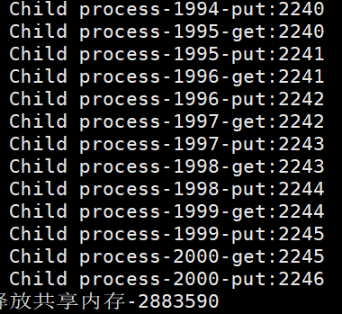
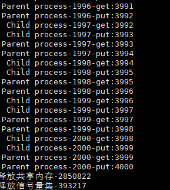

<h1>目录</h1>
[TOC]
<div style="page-break-after: always;"></div>

# 实验三  进程同步 

## 一、实验环境 

Linux 平台 

## 二、实验时间 

4 小时 

## 三、实验目的 

利用信号量机制来实现访问同一共享内存的进程间同步。 

## 四、实验内容 

实现多个进程通过同一内存空间进行通信，要求使用操作系统提供的信号量机制同步这些进程的操作，保证数据一致性。具体要求：请在实验中对比实现使用及未使用信号量的实验效果，并说明是否保证了数据的一致性；可使用多线程实现。 

## 五、实验步骤

创建两个进程，使用共享内存，使两个进程间使用同一数据。在共享内存中，存储一个 int 的数值，让两个进程对这一数值都进行2000次加一操作，对比实现使用及未使用信号量的实验效果。

----

>以下代码只截取的最主要的部分，全部代码参考“实验文件及使用”

### 1. 未使用信号量

在`fork()`后，对同一个信号量进行 2000 次 +1 操作

```c
while (count++ < 2000)
{
    balance = (int *)shmat(mid, NULL, 0);
    tmp = *balance;

    printf("%15s-%4d-get:%d\n", this, count, *balance);
    *balance = tmp + 1;
    printf("%15s-%4d-put:%d\n", this, count, *balance);
    if (shmdt(balance) == -1)
    {
        // 取消映射
        printf("shmdt() error\n");
    }
}
```

### 2. 使用信号量

在未使用信号量的基础上，添加信号量，对临界资源`balance`进行保护

```c
while (count++ < 2000)
{
    semwait(sems_id, 1);  // P 操作
    balance = (int *)shmat(mid, NULL, 0);
    tmp = *balance;
    printf("%15s-%4d-get:%d\n", this, count, *balance);

    *balance = tmp + 1;
    printf("%15s-%4d-put:%d\n", this, count, *balance);
    if (shmdt(balance) == -1)
        {
        // 取消映射
        printf("shmdt() error\n");
        }
    sempost(sems_id, 1);  // V 操作
}
```

### 3. 实验结果

1. 未使用信号量，最终结果并不是 4000

   

2. 使用信号量

   

## 六、实验文件及使用

### 1. 实验文件

```
common.c				// 共享函数
common.h				// 共享头文件
money_without_sem.c		// 没有使用信号量的通讯
money_without_sem.out	// linux 可执行文件
money_with_sem.c		// 使用信号量的通讯
money_with_sem.out		// linux 可执行文件
```

### 2. 编译及执行的指令

1. 未使用信号量

   编译：`gcc common.h common.c money_without_sem.c -o money_without_sem.out`

   执行：`./money_without_sem.out`

2. 使用信号量

   编译：`gcc common.h common.c money_with_sem.c -l pthread -o money_with_sem.out`

   执行：`./money_with_sem.out`


## 七、实验心得

共享内存，使得多个进程可以访问同一块内存空间，是最快的可用IPC形式，是针对其他通信机制运行效率较低而设计的。但是共享内存并没有控制多个进程的同步和互斥，所以往往与其它通信机制，如信号量结合使用，来达到进程间的同步及互斥。

在本次实验中，使用共享内存实现进程间的通讯，并使用信号量来实现对共享内存数据的保护。本次实验在布置实验三之前就已完成，当时并不知道POSIX 信号量的有名信号量，使用 POSIX 信号量中的无名信号量，想要通过无名信号量来进行进程间的通讯，但是无名信号量不能在不同的进程间通讯，如果将无名信号量写入到共享内存，又与我们的初衷——用信号量同步共享内存，相违和，最后选择了 Linux 系统提供的信号量来实现。

Linux 系统提供的信号量相比于 POSIX 的信号量的使用更加复杂一些，需要自己编写有关P和V的操作，但是 Linux 系统提供的信号量有一个好处是并不是直接创建一个信号量，而是一个信号量集，对于多个信号量更加容易管理。

在实际使用中，还存在着一个问题，本次实验将信号量作为互斥信号量来使用，并没有要求进程间的顺序，造成的结果是如果计算量较小的话，子进程还未创建，父进程已经计算完成，使得实验更像是两个独立进程。为了达到两个进程同时开始计算的效果，对父子进程的创建添加了一个同步信号量，只有当子进程创建完成后父进程才可继续执行，实际的效果是，两者之间开始计算的时间的确减少，但是子进程仍比父进程稍晚运行。最终，选择了让两个进程进行大量的操作，使得两个进程间存在对同一共享内存使用的时刻，以达到实验效果。