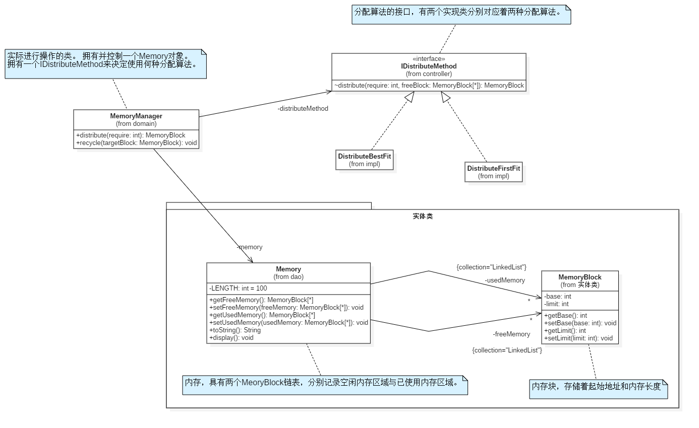
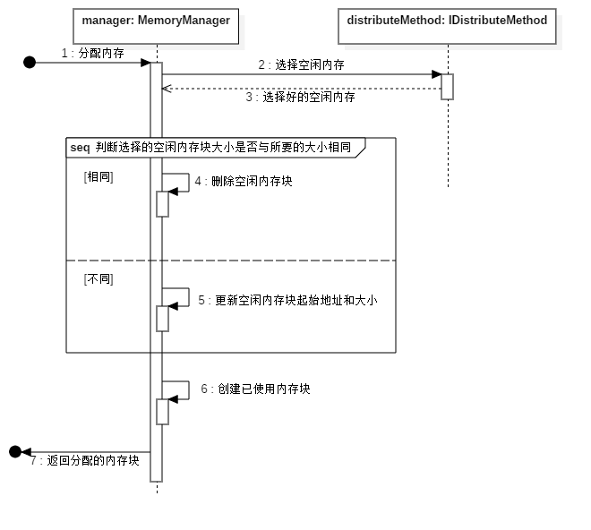

<h1>目录</h1>
[TOC]
<div style="page-break-after: always;"></div>


# 实验四、内存分配实验 

## 实验环境 

Linux平台或Windows 平台 

### 实验时间 

4小时 

### 实验目的 

在熟练掌握计算机分区存储管理方式原理的基础上，利用一种程序设计语言模拟实现操作系统的可变分区存储管理功能。 

### 实验内容 

（1）  设计合理的数据结构来描述存储空间：对于未分配的部分，可以用空闲分区队列或空闲分区链表来描述；对于已分配的部分，由装入内存的作用占据，可以将作业组织为链表或数组。 
（2）  实现内存分配功能，实现两种适应分配算法：最先适应算法、最优适应算法。
（3）  实现分区回收算法：要求能够正确处理回收分区与空闲分区的四种邻接关系 。
（4）  给定一批作业，选择一个分配或回收算法，实现分区存储的模拟管理。 

### 实验步骤 

1. 数据结构

   （使用类图表示，所有信息都以蓝色备注中表示）

   

2. 内存分配流程 

   使用MemoryManager类的distribute方法来实现内存分配，而具体选择空闲内存块具有多种算法，因此将具体选择的算法提取成一个IDistributeMethod接口。MemoryManager类拥有一个实现IDistributeMethod接口的对象，通过调用其distribute方法来实现选择。下面时序图中两个对象的交互呈现了这一点。

   ```java
   public MemoryBlock distribute(int require) {
       LinkedList<MemoryBlock> freeMemory = memory.getFreeMemory();
       MemoryBlock targetBlock = distributeMethod.distribute(require, freeMemory);  // 目标内存
   
       // 判断是否存在符合条件的内存块
       if (targetBlock == null) {
           throw new RuntimeException("没有足够大小的内存");
       }
   
       // 这个内存块将会被分为两块或者一块
       MemoryBlock newUsedyBlock = null;
       if (require == targetBlock.getLimit()) {
           // 1. 被分成一块：全部被使用
           freeMemory.remove(targetBlock);  // 在空闲中删除
           newUsedyBlock = targetBlock;
       } else {
           // 2. 分成两块：一块被使用，一块空闲
           newUsedyBlock = new MemoryBlock(targetBlock.getBase(), require);
           // 更新原来的内存块
           targetBlock.setBase(targetBlock.getBase() + require);
           targetBlock.setLimit(targetBlock.getLimit() - require);
       }
   
       // 添加到已用内存
       memory.getUsedMemory().add(newUsedyBlock);
       return newUsedyBlock;
   }
   ```

   

   1. 总体时序图

      

   2. 最先适应算法代码

      ```java
      /*
          最先适应算法
      */
      @Override
      public MemoryBlock distribute(int require, LinkedList<MemoryBlock> freeBlock) {
          // 遍历空闲内存找到足够大的内存
          MemoryBlock firstFit = null;
          for (MemoryBlock memoryBlock:
               freeBlock) {
              if (memoryBlock.getLimit() > require){
                  firstFit = memoryBlock;
                  break;
              }
          }
      
          return firstFit;
      }
      ```

      

   3. 最优适应算法代码

      ```java
      /*
          最佳适应算法
           */
      @Override
      public MemoryBlock distribute(int require, LinkedList<MemoryBlock> freeBlock) {
          MemoryBlock bestFit = null;  // 目标内存
          int sub = Integer.MAX_VALUE;
          for (MemoryBlock mb:
               freeBlock) {
              // 选择足够大的内存
              if (mb.getLimit() >= require && mb.getLimit() - require < sub) {
                  bestFit = mb;
                  sub = mb.getLimit() - require;
              }
          }
          return bestFit;
      }
      ```

      

3. 分区回收流程 

   分区回收时，就是将已使用的内存块重新放入到空闲内存中，但是这样的话就存在四种情况：1. 被释放的内存块，前后相邻的都不是空闲内存；2. 被释放的内存块，前面相邻的是空闲内存，后面相邻的不是是空闲内存；3. 被释放的内存块，前面相邻的不是是空闲内存，后面相邻的是是空闲内存；4. 被释放的内存块，前后相邻的都是空闲内存。因为对于邻接的空闲内存块，必须将之合并成更大的内存块，所以需要对四种情况进行不同的操作，具体处理见所示流程图。

   

   1. 被释放的内存块，前后相邻的都不是空闲内存。

      直接将释放块插入到顺序的位置。

   2. 被释放的内存块，前面相邻的是空闲内存，后面相邻的不是是空闲内存。

      将被释放内存块前空闲块合并。

   3. 被释放的内存块，前面相邻的不是是空闲内存，后面相邻的是是空闲内存。

      将被释放内存块与后空闲块合并。

   4. 被释放的内存块，前后相邻的都是空闲内存。

      将这连续的三个内存块合并到一起。

   ```java
   public void recycle(MemoryBlock targetBlock) {
       // 1. 在已用中删除
       memory.getUsedMemory().remove(targetBlock);
       // 2. 将释放块放入到空闲内存中，但是存在着四种情况
       /*
           如何判断是那种情况呢？
           用三个值来决定：
               1. 要插入的位置
               2. 是否有前邻接
               3. 是否有后邻接
            */
       LinkedList<MemoryBlock> freeMemory = memory.getFreeMemory();
       int i;
       MemoryBlock before = null, after = null, tmp;
       for (i = 0; i < freeMemory.size(); i++) {
           tmp = freeMemory.get(i);
           // 如果是target的后一块则跳出
           if (targetBlock.getBase() + targetBlock.getLimit() <= tmp.getBase()) {
               if (targetBlock.getBase() + targetBlock.getLimit() == tmp.getBase()) {
                   after = tmp;
               }
               break;
           }
   
           if (tmp.getBase() + tmp.getLimit() == targetBlock.getBase()) {
               before = tmp;
           }
       }
   
       if (before == null && after == null) {
           // 2.1 前后无空闲块：直接将释放块插入到顺序的位置
           freeMemory.add(i, targetBlock);
       } else if (before != null && after == null) {
           // 2.2 前有空闲块，后无空闲块：将释放块与前空闲块合并
           before.setLimit(before.getLimit() + targetBlock.getLimit());
       } else if (before == null && after != null) {
           // 2.3 前无空闲块，后有空闲块：将释放块与后空闲块合并
           after.setLimit(after.getLimit() + targetBlock.getLimit());
       } else {
           // 2.4 前后均为空闲块：将连续的三块合并
           before.setLimit(before.getLimit() + targetBlock.getLimit() + after.getLimit());
           freeMemory.remove(after);
       }
   }
   ```

4. 给定作业的个数，及具体请求内存的大小（即实验输入数据） 

5. 分配后的结果展示（即运行结果展示） 

   > 注：主函数在`com.zlj.os.domain.MemoryManager`中

   

## 总结与感想 

本次实验是关于操作系统中连续内存分配的可变分区分配的操作。 相比于固定分区分配来说，可变分区分配更加的灵活，只要有足够的连续内存就可以分配给进程，但同时也对分区的选择、分配和合并带来了新的要求。对于空闲分区的选择，可以使用最优适应算法以及最先适应算法，但选择后还需要对原有空闲分区进行一次更新操作。对于回收已用分区时，这块分区所处位置前后分区的是否空闲的情况，也需要进行不同的应对，因为存在着可以合并的情况。

在具体实验中，使用 java 实现，并结合设计模式的观念，将实体类、控制类等不同类型的类分割开来，对于分配算法的部分也使用策略模式抽离出来，这次实验不仅仅加深我对操作系统内存管理的理解，还让我更加体会到实践的重要性。