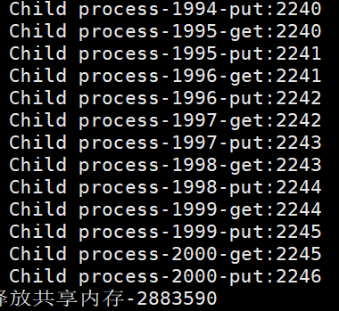

##  实验内容

共享内存，使得多个进程可以访问同一块内存空间，是最快的可用IPC形式。是针对其他通信机制运行效率较低而设计的。往往与其它通信机制，如信号量结合使用，来达到进程间的同步及互斥。在本次实验中，使用共享内存实现进程间的通讯，并使用信号量来实现对共享内存数据的保护。

## 实验内容

### 实验文件

    common.c				// 共享函数
    common.h				// 共享头文件
    money_without_sem.c		// 没有使用信号量的通讯
    money_without_sem.out	// linux 可执行文件
    money_with_sem.c		// 使用信号量的通讯
    money_with_sem.out		// linux 可执行文件
编译和执行的指令

1. 未使用信号量

   编译：`gcc common.h common.c money_without_sem.c -o money_without_sem.out`

   执行：`./money_without_sem.out`

2. 使用信号量

   编译：`gcc common.h common.c money_with_sem.c -l pthread -o money_with_sem.out`

   执行：`./money_with_sem.out`

### 1. 创建通用函数

在`common.c`中创建

```c
int create_ipc(int);  // 创建共享内存
int get_ipc(int);  // 获得共享内存的id
int destory_ipc(int);  // 销毁共享内存

int get_sem(int num);  // 获得 num 个信号量
int set_sem_val(int id, int index, int val);  // 给第 index 个信号量赋初值
int del_sem(int id, int index);  // 删除信号量
int semwait(int id, int index);  // 第 index 个信号量 P 操作
int sempost(int id, int index);  // 第 index 个信号量 V 操作
```

### 2. 未使用信号量

在`fork()`后，对同一个信号量进行 2000 次 +1 操作

```c
while (count++ < 2000)
{
    balance = (int *)shmat(mid, NULL, 0);
    tmp = *balance;

    printf("%15s-%4d-get:%d\n", this, count, *balance);
    *balance = tmp + 1;
    printf("%15s-%4d-put:%d\n", this, count, *balance);
    if (shmdt(balance) == -1)
    {
        // 取消映射
        printf("shmdt() error\n");
    }
}
```

### 3. 使用信号量

在未使用信号量的基础上，添加信号量，对临界资源`balance`进行保护

```c
while (count++ < 2000)
{
    semwait(sems_id, 1);  // P 操作
    balance = (int *)shmat(mid, NULL, 0);
    tmp = *balance;
    printf("%15s-%4d-get:%d\n", this, count, *balance);

    *balance = tmp + 1;
    printf("%15s-%4d-put:%d\n", this, count, *balance);
    if (shmdt(balance) == -1)
        {
        // 取消映射
        printf("shmdt() error\n");
        }
    sempost(sems_id, 1);  // V 操作
}
```

## 实验结果

1. 未使用信号量，最终结果并不是 4000

   

2. 使用信号量，保证了最终结果为4000

   